# MongoDB Workout Questions and Answers


 {
        EmpId: 1,
        EmpFname: "Karan",
        EmpLname: "Mehta",
        Department: "HR",
        Salary: 300000
    },
    {
        EmpId: 2,
        EmpFname: "Rohit",
        EmpLname: "Sharma",
        Department: "Admin",
        Salary: 75000
    },
    {
        EmpId: 3,
        EmpFname: "Ankush",
        EmpLname: "Rajput",
        Department: "Account",
        Salary: 60000
    },
    {
        EmpId: 4,
        EmpFname: "Priyadershini",
        EmpLname: "Sharma",
        Department: "HR",
        Salary: 500000
    },
    {
        EmpId: 5,
        EmpFname: "Sanket",
        EmpLname: "Gupta",
        Department: "Developer",
        Salary: 100000
    },
    {
        EmpId: 6,
        EmpFname: "Shruthi",
        EmpLname: "Varyar",
        Department: "Admin",
        Salary: 80000
    },
    {
        EmpId: 7,  // Corrected EmpId to make it unique
        EmpFname: "Rohit",
        EmpLname: "Sharma",
        Department: "Admin",
        Salary: 75000
    }

----------------------------------------

1. Write a query to find the third highest  salary from the EmployeeInfo collection

db.emp.aggregate([
  {$sort : { Salary: -1 } },
  {$skip: 2},
  {$limit:1}
  ]);

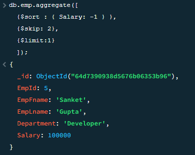

2. Write a query to find the duplicate row in  a collection?

db.emp.aggregate([
  { $group: {
      _id: "$EmpLname",
      count: { $sum:1 },
      duplicates: {$push : "$_id"}
    }},
  {$match:{ 
	count :  { $gt : 1}
	}}
  ])

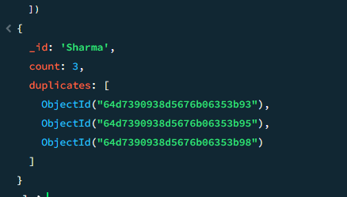


3. Write  a query to calculate the even and odd records from a collection?

4. Write a query to display the first and last record from the EmployeeInfo table collection?

db.emp.find().sort({ _id: 1 }).limit(1)
db.emp.find().sort({ _id: -1 }).limit(1)

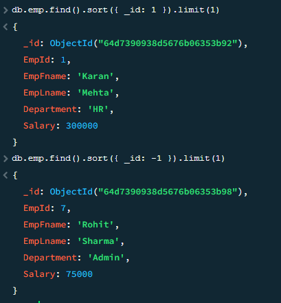

5. How do you copy all documents of a collection using query ?

db.emp.aggregate([
  {$match : {}},
  {$out : "newCollection"}
]);


6. Write  a query to retrieve the list of employees working in the same department ?

db.emp.find({Department : "HR"})

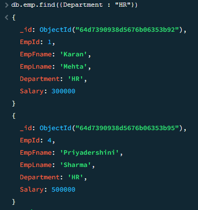

7. Write a query to retrieve the last 3 records from the EmployeeInfo collection ?

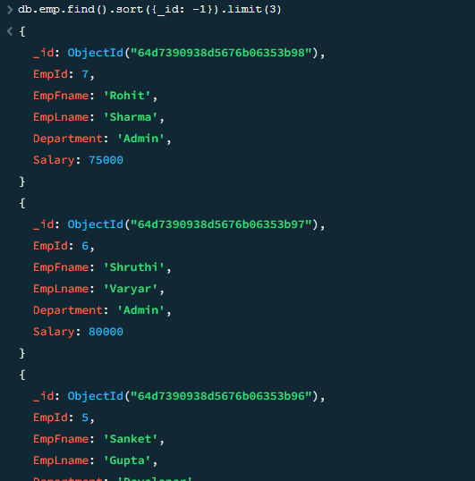

8. Write a query to fetch details of an employee whose EmpLname ends with an alphabet ‘A’ and contains five alphabets ?

db.emp.find({
EmpLname: { $regex: /^[A-Za-z]{4}a$/ }
})


----------------------------------------

"_id" : ObjectId("6014dc988c628fa57a508088"),
"Age" : "Middle",
"Gender" : "Male",
"OwnHome" : "Rent",
"Married" : "Single",
"Location" : "Close",
"Salary" : 63600,
"Children" : 0,
"History" : "High",
"Catalogs" : 6,
"AmountSpent" : 1318


1. Add more document inside the marketing collection. 

db.marketting.insertMany([
  {
    "Age": "Young",
    "Gender": "Female",
    "OwnHome": "Own",
    "Married": "Single",
    "Location": "Far",
    "Salary": 50000,
    "Children": 1,
    "History": "Low",
    "Catalogs": 4,
    "AmountSpent": 1000
  },
  {
    "Age": "Middle",
    "Gender": "Male",
    "OwnHome": "Rent",
    "Married": "Married",
    "Location": "Close",
    "Salary": 70000,
    "Children": 2,
    "History": "Medium",
    "Catalogs": 8,
    "AmountSpent": 2000
  }
])

db.marketting.find()

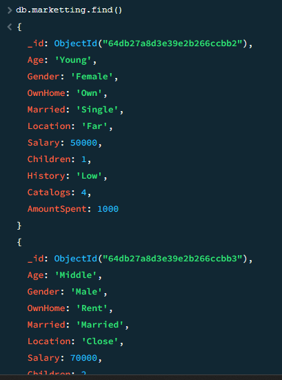


2. Write a query to find the 2nd document from the collection.

db.marketting.find().limit(1).skip(1)

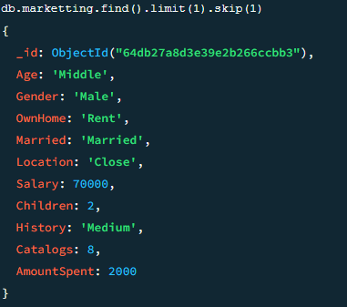


3. Write a query to find out the average spent amount of customers who received more than 10 catalogs


db.marketting.aggregate([
  {
    $match: {
      Catalogs: { $gte: 4 }
    }
  },
{
    $group: {
      _id: null,
      avgAmountSpent: { $avg: "$AmountSpent" } // Calculate average spent amount
    }
  }
]);

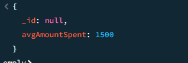


4. Write a query to calculate the average salary and the total spent amount for customers who have at least 1 child

db.marketting.aggregate([
  {
    $match: {
      Children: { $gte: 1 } 
    }
  },
  {
    $group: {
      _id: null,
      avgSalary: { $avg: "$Salary" }, 
      totalAmountSpent: { $sum: "$AmountSpent" } 
    }
  }
]);

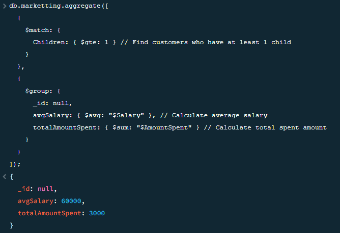


-------------------------------------------------------------


collection name : movies

``````
 {"_id": 0,title: "Movie A",  year: 2010, director: "D1", actors: ["A1","A2"] }
      ,{"_id": 1,title: "Movie B",  year: 2010, director: "D1", actors: ["A1","A5","A6"]}
      ,{"_id": 2,title: "Movie C",  year: 2010, director: "D2", actors: ["A4"]}
      ,{"_id": 3,title: "Movie D",  year: 2012, director: "D3", actors: ["A7"]}
      ,{"_id": 4,title: "Movie E",  year: 2015, director: "D3", actors: ["A7"]}
``````


1. Write a query to campaign documents and return all movie details when the same directors 


```javascript
db.movies.aggregate([
  {
    $group: {
      _id: "$director",
      movies: { $push: "$$ROOT" }
    }
  }
]);
```

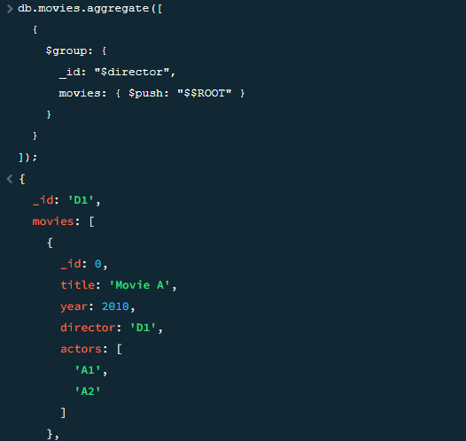


--------------------------------

```
Collection : orders
   
[{ "_id" : 1, "item" : "almonds", "price" : 12, "quantity" : 2 },
  { "_id" : 2, "item" : "pecans", "price" : 20, "quantity" : 1 },

  { "_id" : 3  }]

Collection : inventory

[{ "_id" : 2, "sku" : "bread", "description": "product 2", "instock" : 80 },
  { "_id" : 3, "sku" : "cashews", "description": "product 3", "instock" : 60 },
 { "_id" : 4, "sku" : "pecans", "description": "product 4", "instock" : 70 },
{ "_id" : 5, "sku": null, "description": "Incomplete" },
{ "_id" : 6 }]

```

1. Write a query to show the item, price, quantity, instock from each product from the above collection.

````javascript 
db.orders.aggregate([
{
$lookup: {
from: "inventory",
localField: "sku",
foreignField: "item",
as:"inventoryDetails"
	}
},
{
$unwind:"$inventoryDetails"
},
{
	$project:{
_id:0,
item: "$inventoryDetails.sku"	,
price:1,
quantity:1,
inStock:"$inventoryDetails.instock"
	}
}
])
````

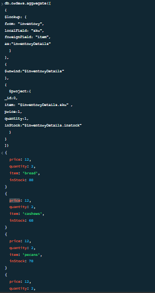


--------------------------------------------------------------------------

```
Collection: classes 

[
 { _id: 1, title: "Reading is ...", enrollmentlist: [ "giraffe2", "pandabear", "artie" ], days: ["M", "W", "F"] },
{ _id: 2, title: "But Writing ...", enrollmentlist: [ "giraffe1", "artie" ], days: ["T", "F"] }
]

Collection: members


{ _id: 1, name: "artie", joined: new Date("2016-05-01"), status: "A" },
 { _id: 2, name: "giraffe", joined: new Date("2017-05-01"), status: "D" },
{ _id: 3, name: "giraffe1", joined: new Date("2017-10-01"), status: "A" },
  { _id: 4, name: "panda", joined: new Date("2018-10-11"), status: "A" },
 { _id: 5, name: "pandabear", joined: new Date("2018-12-01"), status: "A" },
 { _id: 6, name: "giraffe2", joined: new Date("2018-12-01"), status: "D" }


```

1. Write a query to show the document when matching all data from the enrollment list in the classes collection to the name of the member collection? 


``` javascript 

db.classes.aggregate([
  {
    $lookup: {
      from: "members",
      localField: "name",
      foreignField: "entrollmentlist",
      as: "enrolledMembers"
    }
  },
  {
    $match: {
      $expr: {
        $eq: ["$enrollmentlist", "$enrolledMembers.name"]
      }
    }
  }
]);
```


