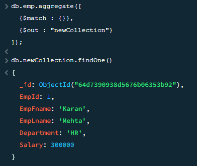

# MongoDB Workout Questions and Answers

 {
        EmpId: 1,
        EmpFname: "Karan",
        EmpLname: "Mehta",
        Department: "HR",
        Salary: 300000
    },
    {
        EmpId: 2,
        EmpFname: "Rohit",
        EmpLname: "Sharma",
        Department: "Admin",
        Salary: 75000
    },
    {
        EmpId: 3,
        EmpFname: "Ankush",
        EmpLname: "Rajput",
        Department: "Account",
        Salary: 60000
    },
    {
        EmpId: 4,
        EmpFname: "Priyadershini",
        EmpLname: "Sharma",
        Department: "HR",
        Salary: 500000
    },
    {
        EmpId: 5,
        EmpFname: "Sanket",
        EmpLname: "Gupta",
        Department: "Developer",
        Salary: 100000
    },
    {
        EmpId: 6,
        EmpFname: "Shruthi",
        EmpLname: "Varyar",
        Department: "Admin",
        Salary: 80000
    },
    {
        EmpId: 7,  // Corrected EmpId to make it unique
        EmpFname: "Rohit",
        EmpLname: "Sharma",
        Department: "Admin",
        Salary: 75000
    }

----------------------------------------

1. Write a query to find the third highest  salary from the EmployeeInfo collection

db.emp.aggregate([
  {$sort : { Salary: -1 } },
  {$skip: 2},
  {$limit:1}
  ]);

2. Write a query to find the duplicate row in  a collection?

db.emp.aggregate([
  { $group: {
      _id: "$EmpLname",
      count: { $sum:1 },
      duplicates: {$push : "$_id"}
    }},
  {$match:{ 
	count :  { $gt : 1}
	}}
  ])

3. Write  a query to calculate the even and odd records from a collection?

4. Write a query to display the first and last record from the EmployeeInfo table collection?

db.emp.find().sort({ _id: 1 }).limit(1)
db.emp.find().sort({ _id: -1 }).limit(1)

5. How do you copy all documents of a collection using query ?

db.emp.aggregate([
  {$match : {}},
  {$out : "newCollection"}
]);

6. Write  a query to retrieve the list of employees working in the same department ?

db.emp.find({Department : "HR"})

7. Write a query to retrieve the last 3 records from the EmployeeInfo collection ?

8. Write a query to fetch details of an employee whose EmpLname ends with an alphabet ‘A’ and contains five alphabets ?

db.emp.find({
EmpLname: { $regex: /^[A-Za-z]{4}a$/ }
})

----------------------------------------

"_id" : ObjectId("6014dc988c628fa57a508088"),
"Age" : "Middle",
"Gender" : "Male",
"OwnHome" : "Rent",
"Married" : "Single",
"Location" : "Close",
"Salary" : 63600,
"Children" : 0,
"History" : "High",
"Catalogs" : 6,
"AmountSpent" : 1318

1. Add more document inside the marketing collection. 

db.marketting.insertMany([
  {
    "Age": "Young",
    "Gender": "Female",
    "OwnHome": "Own",
    "Married": "Single",
    "Location": "Far",
    "Salary": 50000,
    "Children": 1,
    "History": "Low",
    "Catalogs": 4,
    "AmountSpent": 1000
  },
  {
    "Age": "Middle",
    "Gender": "Male",
    "OwnHome": "Rent",
    "Married": "Married",
    "Location": "Close",
    "Salary": 70000,
    "Children": 2,
    "History": "Medium",
    "Catalogs": 8,
    "AmountSpent": 2000
  }
])

db.marketting.find()

2. Write a query to find the 2nd document from the collection.

db.marketting.find().limit(1).skip(1)

3. 